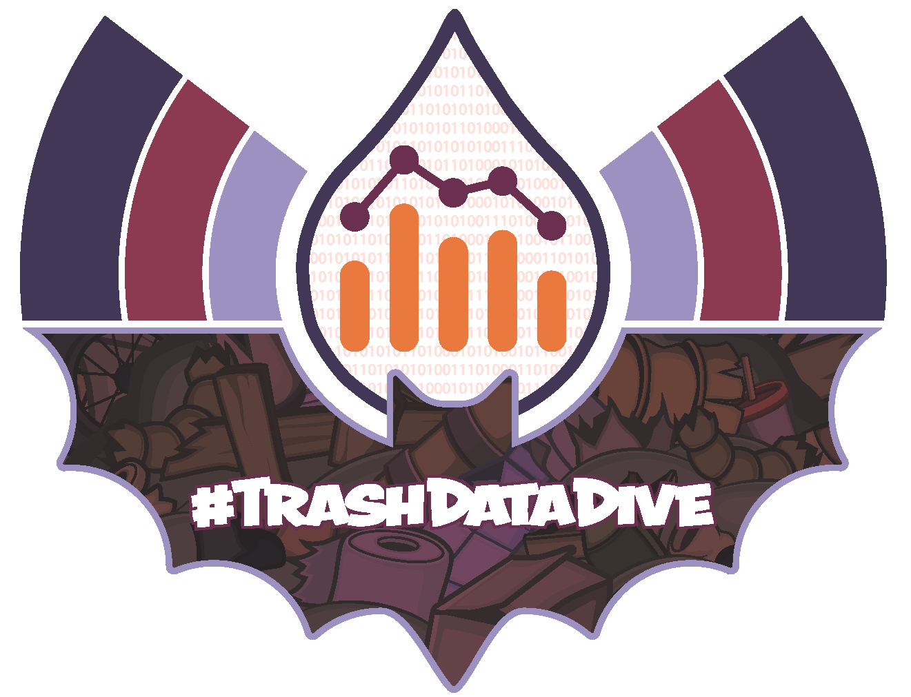
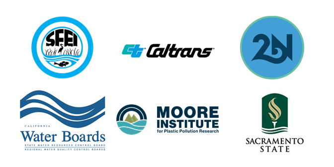

# California Trash Data Dive 2021

 

**Dates**: October 28-29, 2021

**Location**: Entirely virtual, via Zoom

**Organizer**: Dr. Corey Clatterbuck, California Sea Grant State Fellow, CA State Water Boards - [email me!](mailto:Corey.Clatterbuck@waterboards.ca.gov)

**Ready to register?**: Registration is now closed. All registrants were sent confirmation emails with how to join the event. If you have any questions, please [email](mailto:Corey.Clatterbuck@waterboards.ca.gov) Corey Clatterbuck.

***

### Purpose
The Trash Data Dive is an annual forum for data scientists, environmental planners, trash regulators, land use experts, and advocates for environmental justice to discuss and collaborate on trash data & policy. The goal of the Data Dive is to use trash data effectively to drive improved and equitable social and environmental outcomes. This year, Data Dive participants will spend 2 days building and sharing technological, policy, and storytelling innovations leading towards less trash in our communities. 

***

### Community Participation Guidelines
In order to facilitate a productive and effective event, we ask that all participants follow the guidelines below. They were developed with the event planning team and borrow heavily from the [Openscapes](https://www.openscapes.org/code-of-conduct/) code of conduct and training materials, including this [piece](https://eyeondesign.aiga.org/are-codes-of-conduct-changing-the-diversity-stats-in-open-source/) from Margaret Rhodes, and the Southern California Academy of Sciences.

1. Be inclusive: respect and facilitate others’ participation whether they are:
    * Non-native language speakers
    * Using pronouns other than he or she
    * On or off-camera
    * Facing other challenges to participation
2. Move up & move up: If you tend to not speak a lot, please move up into a role of saying more. If you tend to speak a lot, please move up into a role of listening more.
3. Be open to other perspectives -- these will make your ideas better!
4. Remember to approach each interaction with patience and care
5. We encourage authentic and non-judgmental feedback
6. Do not attack, demean, harass, or threaten others or encourage this behavior  

To report violations of these guidelines, please contact event organizer Corey Clatterbuck, Corey.Clatterbuck@waterboards.ca.gov, with a description of what has occurred and any supporting information that may be helpful in describing the situation. Corey will meet with Nick Martorano and potentially the session chair, as applicable and if asked, to determine next steps. 

***

### Daily schedule -- *tentative*

Events are held from 9:30am - 3:30pm PDT (UTC -7) each day. Participants should select 1-2 breakout *groups* to return to during breakout *sessions* throughout the event. 

|date *time* | event              | leader               |
|------------|--------------------|----------------------|
|**Thursday, October 28**|
|*9:30am*    | Welcome            | Corey Clatterbuck & Greg Gearheart
|*9:45am*    | Keynote            | TBA
|*10:25am*   | Break              |
|*10:30am*   | Introduce breakout sessions | Corey & Breakout organizers
|*10:45am*   | Breakout Session 1 | Breakout organizers
|*12:15pm*   | Lunch              | on your own
|*1:00pm*    | AI/ML demo: Google Litter Insights Platform | Google Cloud team
|*1:30pm*    | Breakout Session 2 | Breakout organizers
|*3:15pm*    | Wrap-up Day 1      | Breakout organizers
|*3:30pm*    | Event end          |
|**Friday, October 29**|
|*9:30am*    | Welcome back!      | Corey Clatterbuck
|*9:45am*    | [Caltrans Stormwater Public Education Campaign](https://CleanCA.com) | Michelle Alexander
|*10:20am*   | Break              |
|*10:30am*   | Breakout Session 3 | Breakout organizers
|*12:15pm*   | Lunch              | on your own
|*1:00pm*    | Breakout Session 4 | Breakout organizers
|*2:30pm*    | Wrap-up Day 2      | Breakout organizers
|*3:30pm*    | Event end          |

***

### What are the breakout groups?

Participants should select 1-2 breakout *groups* to return to during breakout *sessions* throughout the event.

**Assessing Utility of Track 2 Trash Amendment Data Collection Strategies Throughout California**  
**Organizers:** [Dr. Win Cowger](www.wincowger.com), [Gary Conley](https://www.2ndnaturewater.com/about/), Jarma Bennett, and [Dr. Julian Fulton](https://www.researchgate.net/profile/Julian-Fulton-2)  
Track 2 trash amendment compliance is happening throughout the State, with permitted entities implementing litter interventions and assessing their effectiveness at a range of scales. The diversity of approaches towards both implementation and progress tracking will pose challenges for meaningful comparisons of program efficacy across the state, quantifying aggregate progress, and for identifying the most effective measures. This workgroup will focus on the state of track 2 data collection and reporting. We will explore similarities and differences of the data collected, identify critical information gaps, and share preliminary insights on the efficacy of strategies to eliminate trash delivery to receiving waters.  

**Remote ecosystem to tell trash stories**  
**Organizers:** [Shelly Moore](https://mooreplasticresearch.org/staff/), [Sarah Hutmacher](https://www.sandiegoriver.org/our_team.html), and [Don McEnhill](https://russianriverkeeper.org/don-mcenhill/)  
Past datathons have discussed the importance and need for storytelling on trash. This breakout would provide a virtual platform and tools to tell trash stories. *More information to come*

**Machine learning to make trash data clean**  -- *Thursday, October 28th only*  
**Organizers:** Walter Yu & [Dr. Tony Hale](https://www.sfei.org/users/tony-hale)  
Artificial intelligence and machine learning (AI/ML) is gaining adoption in many disciplines, including litter abatement and stormwater management, so this breakout session will focus on specific use cases and applications. Also, this session will build on the Litter Insights Platform presentation by the Google Cloud team, which Google is developing to identify litter using AI and Google Street View imagery. Session topics will general discussion, brainstorming and a hands-on exercise with machine learning to encourage additional development and collaboration by participants. No coding experience is required, but this session will provide some accessible tools to help analysts and others interested in visualizing trash data dive into code that leverages some recent innovations.  

The session topics will include:
1.	AI/ML Presentation and Group Discussion
2.	Group Exercises  
    a. Computer Vision – Litter Detection (Google Colab)  
    b.	Open Refine – Data Cleaning with AI/ML  
    c.	Other – Trash Classifier, Data Visualization and Open Data (Jan 2021 Session)

***

### How do I join?  
Register on [Zoom](https://waterboards.zoom.us/meeting/register/tJcpcequqjooG9fOcH59gx3ckXFx4oHMfy7n) by Monday, October 25th. All registrants will receive a calendar invite and link to our Zoom meeting room for the 2 days of the event! 

***

### How should I prepare?
1. Download [Zoom](https://zoom.us/) for desktop (preferable) or mobile. 
2. Register with Zoom
3. Change your [Display Name](https://support.zoom.us/hc/en-us/articles/201363203-Customizing-your-profile) in your Zoom profile to reflect your public name
4. Get excited to talk about trash in our communities!

***

### Where are the past trash data events?
[2018 Trash Data Dive Resources](https://github.com/SCCWRP/2018TrashDataDive)

[February 2021 Trash Data Dive](https://sites.google.com/sfei.org/trash/notes-from-the-field/trash-workshop)

[Other Trash Datathon Resources](https://cawaterboarddatacenter.github.io/Datathon-Resources/TrashProjects.html)

***

### Partners

 
